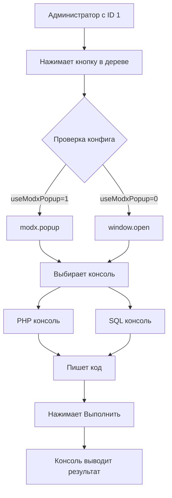

# Evolution Console

Мощная веб-консоль для Evolution CMS, предоставляющая инструменты для выполнения PHP кода и SQL запросов прямо из браузера.

## Возможности

### PHP Консоль
- Выполнение PHP кода в реальном времени
- Подсветка синтаксиса с помощью Ace Editor
- Автодополнение кода для Evolution CMS
- Отображение результатов выполнения и ошибок
- Мониторинг использования памяти и времени выполнения

### SQL Консоль  
- Выполнение SQL запросов к базе данных
- Табличное отображение результатов
- Автодополнение для таблиц и колонок
- Информация о затронутых строках
- Время выполнения запросов

### Общие возможности
- Современный адаптивный интерфейс
- Поддержка тем оформления \(темные/светлые\)
- История команд с поиском

## Установка

### Шаги установки
Выполните команды из директории `/core`:

1. Установка пакета
```
php artisan package:installrequire roilafx/consolevo "*"
```
2. Публикация стилей и скриптов
```
php artisan vendor:publish --provider="roilafx\Consolevo\ConsolevoServiceProvider"
```

## Архитектура

Проект построен на модульной архитектуре с четким разделением ответственности:

### ConsoleManager
Центральный фасад, координирующий работу всех модулей:
- Инициализация и настройка компонентов
- Управление жизненным циклом
- Обработка ошибок
- Предоставление единого API

### Модули
- **AceEditor** - управление редактором кода с автодополнением
- **OutputManager** - отображение результатов и сообщений
- **ApiClient** - взаимодействие с сервером выполнения кода
- **PreferencesManager** - управление настройками пользователя
- **StateManager** - автосохранение состояния
- **CommandHistory** - ведение истории команд
- **HistoryModal** - интерфейс просмотра истории

## Настройки

### Доступные настройки
- `theme` - тема оформления редактора
- `fontSize` - размер шрифта \(12-18px\)
- `wrapMode` - перенос строк
- `enableAutocomplete` - автодополнение кода
- `showLineNumbers` - показ номеров строк
- `highlightActiveLine` - подсветка активной строки

### Сохранение настроек
Настройки автоматически сохраняются в localStorage браузера и синхронизируются между консолями.

## Разработка

### Добавление новой темы
1. Добавить тему в `THEMES` константу
2. Подключить файл темы в соответствующем view
3. Обновить ThemeManager при необходимости

### Расширение функциональности
1. Создать новый модуль в `js/modules/`
2. Зарегистрировать в `ConsoleManager`
3. Добавить в порядок инициализации в `MODULES_CONFIG`

### Кастомные сниппеты
Для добавления кастомных сниппетов автодополнения:
- PHP: редактировать `utils/php-completion-data.js`
- SQL: редактировать `utils/completion-data.js`

## Безопасность

### Рекомендации по использованию
1. Ограничьте доступ к консоли только доверенным пользователям
2. Мониторьте логи выполнения
3. Используйте в development среде или с осторожностью в production

## Поддержка

При возникновении проблем или вопросов:
1. Проверьте логи браузера \(F12\)
2. Убедитесь в корректности прав доступа
3. Проверьте совместимость версий Evolution CMS


# Сценарий использования консоли:



## Структура файлов:

```text
consolevo/
├── plugins/
│   └── plugin.AddConsole.php           # Добавляет кнопку в боковое меню
├── publishable/
│   └── assets/
│       └── plugins/
│           └── consolevo/
│               ├── ace-editor/         # Редактор кода (библиотека Ace-Editor)
│               │   ├── snippets/       # Сниппеты для автодополнения
│               │   │   ├── php.js      # PHP сниппеты
│               │   │   └── sql.js      # SQL сниппеты
│               │   ├── ace.js          # Ядро
│               │   ├── mode-php.js     # Подсветка PHP синтаксиса
│               │   ├── mode-sql.js     # Подсветка SQL синтаксиса
│               │   └── *.js            # Расширения и темы
│               ├── config/
│               │   └── consolevo.php   # Конфигурация плагина (0/1)
│               ├── css/
│               │   ├── console.css     # Стили главной страницы
│               │   └── php-sql-console.css # Стили редакторов PHP/SQL
│               ├── fontawesome-7.1.0/  # Библиотека иконок
│               └── js/
│                   ├── modules/
│                   │   ├── AceEditor.js          # Работа с редактором кода
│                   │   ├── ApiClient.js          # Запросы к серверу
│                   │   ├── ConsoleManager.js     # Фасад/координатор системы
│                   │   ├── CommandHistory.js     # История команд
│                   │   ├── HistoryModal.js       # Модальное окно истории
│                   │   ├── OutputManager.js      # Управление выводом консоли
│                   │   ├── PreferencesManager.js # Настройки пользователя
│                   │   └── StateManager.js       # Сохранение состояния редактора
│                   ├── utils/
│                   │   ├── analyze-evo.js        # Для автодополнения PHP
│                   │   ├── completion-data.js    # Данные для автодополнения SQL
│                   │   ├── constants.js          # Константы и конфигурация
│                   │   └── helpers.js            # Вспомогательные функции
│                   └── console.js                # Точка входа
├── src/
│   ├── Analyzers/
│   │   └── EvoAnalyzer.php            # Анализ Evolution CE для подсказок
│   ├── Controllers/
│   │   ├── ConsoleController.php      # Контроллер главной страницы
│   │   ├── PhpConsoleController.php   # Контроллер PHP консоли
│   │   ├── SqlConsoleController.php   # Контроллер SQL консоли
│   │   └── AnalysisController.php     # Контроллер анализа Evolution CE
│   ├── Middleware/
│   │   └── ConsolevoAccess.php        # Проверка прав доступа
│   └── ConsolevoServiceProvider.php   # Сервис-провайдер плагина
├── views/
│   ├── layouts/
│   │   └── app.blade.php              # Базовый макет
│   ├── partials/
│   │   ├── console-card.blade.php     # Карточка редактора кода
│   │   ├── console-header.blade.php   # Шапка консоли
│   │   └── status-bar.blade.php       # Статус-бар
│   ├── console.blade.php              # Главная страница
│   ├── php-console.blade.php          # PHP консоль
│   ├── sql-console.blade.php          # SQL консоль
│   └── tree-button.blade.php          # Кнопка в дереве документов
├── composer.json                      # Зависимости Composer
├── routes.php                         # Маршруты плагина
└── README.md<-------------------------# Вы тут
```