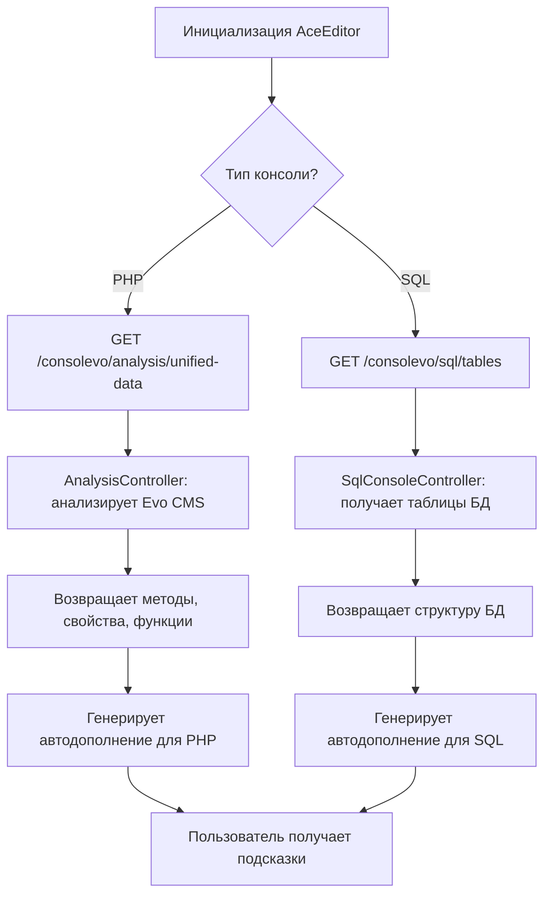

# AnalysisController

## Назначение
Контроллер для предоставления данных автодополнения для Evolution CMS. Анализирует ядро системы и предоставляет информацию о методах, свойствах, константах и функциях.

### Схема автодополнения



### Методы

#### getUnifiedData()
**Endpoint:** GET /consolevo/analysis/unified-data

**Назначение:** Основной метод для получения всех данных автодополнения в едином формате.

**Логика работы:**
1. Создает экземпляр EvoAnalyzer
2. Генерирует данные анализа
3. Проверяет структуру данных
4. Возвращает JSON ответ со статистикой

**Ответ при успехе:**
```json
{
    "success": true,
    "data": {
        "methods": [...],
        "properties": [...],
        "constants": [...],
        "functions": [...],
        "generated_at": "2024-01-15 10:30:00",
        "version": "1.0"
    },
    "source": "dynamic",
    "timestamp": 1705311000,
    "stats": {
        "methods": 150,
        "properties": 80,
        "constants": 50,
        "functions": 25
    }
}
```

**Ответ при ошибке:**
```json
{
    "success": false,
    "error": "Сообщение об ошибке",
    "timestamp": 1705311000
}
```

**HTTP статусы:**
- 200: Успешный запрос
- 500: Внутренняя ошибка сервера

#### ensureArrayStructure(array $data): array
**Назначение:** Вспомогательный метод для гарантии корректной структуры данных.

**Параметры:**
- $data (array): Входные данные анализа

**Возвращает:**
Массив с гарантированными полями:
- methods (array)
- properties (array)
- constants (array)
- functions (array)
- generated_at (string)
- version (string)

#### calculateStats(array $data): array
**Назначение:** Расчет статистики по данным.

**Параметры:**
- $data (array): Данные анализа

**Возвращает:**
Массив с количеством элементов в каждом разделе:
- methods (int)
- properties (int)
- constants (int)
- functions (int)

## EvoAnalyzer

### Назначение
Сервисный класс для анализа кодовой базы Evolution CMS. Выполняет статический анализ PHP файлов для извлечения информации о структуре классов и функций.

### Основные методы

#### analyzeCoreClasses()
**Назначение:** Анализ всех классов в директории src ядра Evolution CMS.

**Логика работы:**
1. Рекурсивное сканирование директории EVO_CORE_PATH/src
2. Анализ каждого найденного PHP файла
3. Извлечение методов с параметрами, свойств и констант
4. Добавление глобальных функций Evolution CMS

**Возвращает:**
Массив с четырьмя ключами:
- methods: Массив методов с параметрами
- properties: Массив свойств классов
- constants: Массив констант классов
- functions: Массив глобальных функций

#### generateCompletionData(): array
**Назначение:** Генерация финальных данных для автодополнения.

**Логика работы:**
1. Вызов analyzeCoreClasses()
2. Обработка и очистка данных
3. Добавление метаданных (время генерации, версия)

**Возвращает:**
Структурированные данные для API:
- methods: Уникальные методы с параметрами
- properties: Уникальные свойства
- constants: Уникальные константы
- functions: Глобальные функции
- generated_at: Временная метка
- version: Версия данных

### Вспомогательные методы

#### scanSrcDirectory($directory)
**Назначение:** Рекурсивное сканирование директории для поиска PHP файлов.

**Параметры:**
- $directory (string): Путь к директории для сканирования

**Возвращает:**
Ассоциативный массив [className => filePath]

#### extractClassNameFromFile($filePath)
**Назначение:** Извлечение полного имени класса из PHP файла.

**Параметры:**
- $filePath (string): Путь к PHP файлу

**Возвращает:**
Полное имя класса (с namespace) или null

#### analyzeClassWithParams($className, $filePath, &$analysis)
**Назначение:** Анализ конкретного класса с извлечением параметров методов.

**Параметры:**
- $className (string): Имя класса
- $filePath (string): Путь к файлу класса
- &$analysis (array): Ссылка на массив анализа

**Извлекает:**
- Методы с их параметрами
- Свойства классов
- Константы классов

#### parseParameters($paramsString)
**Назначение:** Парсинг строки параметров метода.

**Параметры:**
- $paramsString (string): Строка параметров из сигнатуры метода

**Возвращает:**
Массив параметров с информацией:
- name: Имя параметра (например, $param)
- default: Значение по умолчанию
- full: Полное описание параметра

#### analyzeGlobalFunctionsWithParams(&$analysis)
**Назначение:** Добавление предопределенных глобальных функций Evolution CMS.

**Параметры:**
- &$analysis (array): Ссылка на массив анализа

**Добавляет:**
Базовые функции Evolution CMS с их параметрами