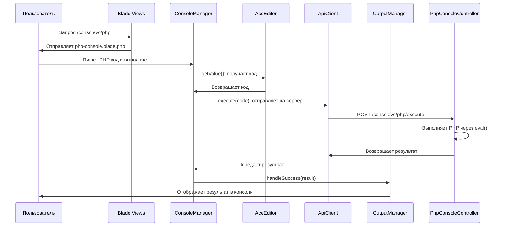

# PhpConsoleController

## Назначение
Контроллер для работы с PHP консолью в системе Consolevo. Предоставляет интерфейс для выполнения PHP кода в контексте Evolution CMS с учетом прав менеджера и системой безопасности.

## Схема работы PHP-консоли



## Класс
**Пространство имен:** `roilafx\Consolevo\Controllers`

**Имя класса:** `PhpConsoleController`

## Методы

### index()
**Маршрут:** `GET /consolevo/php`

**Имя маршрута:** `consolevo.php`

**Назначение:** Отображение интерфейса PHP консоли.

**Возвращаемое значение:**
- `Illuminate\View\View` - представление PHP консоли

**Используемое представление:**
- `consolevo::php-console` - Blade шаблон интерфейса PHP консоли

### execute(Request $request): JsonResponse
**Маршрут:** `POST /consolevo/php/execute`

**Имя маршрута:** `consolevo.php.execute`

**Назначение:** Выполнение PHP кода, отправленного из интерфейса консоли.

**Параметры:**
- `Request $request` - HTTP запрос с данными

**Входные данные (JSON):**
```json
{
    "code": "<?php echo 'Hello World'; ?>"
}
```

**Логика работы:**
1. Проверка наличия кода
2. Валидация и нормализация кода
3. Проверка на критически опасные операции
4. Выполнение кода в контексте Evolution CMS
5. Форматирование и возврат результата

**Успешный ответ:**
```json
{
    "success": true,
    "output": "Вывод буферизации",
    "result": "Форматированный результат",
    "execution_time": 0.1234,
    "memory_usage": 10240
}
```

**Ошибка при пустом коде (400):**
```json
{
    "success": false,
    "error": "Пустой код"
}
```

**Ошибка выполнения (500):**
```json
{
    "success": false,
    "error": "Сообщение об ошибке",
    "line": 25
}
```

## Вспомогательные методы

### executeAsManager(string $code): array
**Назначение:** Основной метод выполнения PHP кода с правами менеджера.

**Параметры:**
- `string $code` - PHP код для выполнения

**Возвращает:**
Массив с результатами выполнения:
- `output` (string) - вывод буферизации
- `result` (string) - форматированный результат выполнения
- `execution_time` (float) - время выполнения в секундах
- `memory_usage` (int) - использование памяти в байтах

**Логика работы:**
1. Замер времени и памяти
2. Нормализация PHP кода
3. Проверка на критические угрозы безопасности
4. Буферизация вывода
5. Выполнение кода с доступом к Evolution CMS
6. Обработка ошибок выполнения
7. Расчет метрик

**Исключения:**
- `Exception` при обнаружении критически опасного кода
- `ParseError` при синтаксических ошибках
- `Throwable` при других ошибках выполнения

### containsCriticalDanger(string $code): bool
**Назначение:** Проверка PHP кода на наличие критически опасных операций.

**Параметры:**
- `string $code` - PHP код для проверки

**Возвращает:**
- `true` - если обнаружены опасные операции
- `false` - если код безопасен

**Проверяемые опасные операции:**

1. **Выполнение системных команд:**
   - `eval`, `exec`, `system`, `shell_exec`, `passthru`, `proc_open`, `popen`, `pcntl_exec`

2. **Опасные файловые операции с относительными путями:**
   - `unlink`, `rmdir`, `chmod`, `chown` с путями содержащими `../`

3. **Сетевые операции с внешними адресами:**
   - `fsockopen`, `pfsockopen`, `stream_socket_client` с HTTP/FTP протоколами

4. **Изменение критических настроек PHP:**
   - `ini_set`, `dl` с параметрами `safe_mode`, `disable_functions`, `open_basedir`

5. **Создание файлов в системных путях:**
   - `file_put_contents`, `fopen` с путями `/etc`, `/root`, `/windows`, `C:\\windows`

**Примечание:** Метод проверяет только критические угрозы. Возможны ложные срабатывания при анализе строковых литералов.

### executeWithEvoAccess(string $code)
**Назначение:** Выполнение PHP кода с полным доступом к API Evolution CMS.

**Параметры:**
- `string $code` - PHP код для выполнения

**Возвращает:**
- Результат выполнения кода (mixed)

**Создаваемый контекст:**
```php
[
    'evo' => evolutionCMS(),      // Основной объект Evolution CMS
    'modx' => evolutionCMS(),     // Псевдоним для совместимости
    'user' => [                   // Информация о текущем пользователе
        'id' => $_SESSION['mgrInternalKey'],
        'username' => $_SESSION['mgrShortname'],
        'role' => $_SESSION['mgrRole'],
        'email' => $_SESSION['mgrEmail'],
        'fullname' => $_SESSION['mgrFullName']
    ],
    'config' => evolutionCMS()->config, // Конфигурация системы
    'db' => evolutionCMS()->getDatabase() // Объект базы данных
]
```

**Ограничения безопасности:**
- `set_time_limit(30)` - лимит выполнения 30 секунд
- `ini_set('memory_limit', '256M')` - лимит памяти 256 МБ

**Используемые функции:**
- `extract()` - импорт переменных контекста в локальную область видимости
- `eval()` - выполнение PHP кода

### normalizePhpCode(string $code): string
**Назначение:** Нормализация PHP кода - удаление открывающих/закрывающих тегов PHP.

**Параметры:**
- `string $code` - исходный PHP код

**Возвращает:**
- `string` - нормализованный PHP код без тегов

**Преобразования:**
1. Удаляет `<?php` или `<?` в начале
2. Удаляет `?>` в конце
3. Удаляет `?><?php` в середине кода
4. Обрезает пробельные символы

**Пример:**
```php
Вход: "<?php echo 'Hello'; ?>"
Выход: "echo 'Hello';"
```

### formatResult($result): string
**Назначение:** Форматирование результата выполнения PHP кода для отображения.

**Параметры:**
- `mixed $result` - результат выполнения кода

**Возвращает:**
- `string` - форматированное строковое представление

**Логика форматирования:**

1. **Null:** возвращает `'null'`
2. **Boolean:** возвращает `'true'` или `'false'`
3. **Скалярные значения:** преобразует в строку
4. **Объекты:**
   ```php
   "[object ClassName] methods: X, properties: Y"
   ```
5. **Массивы:**
   - Пустой: `"[array] empty"`
   - Больше 20 элементов: `"[array] X elements"`
   - До 20 элементов: JSON представление с форматированием
6. **Ресурсы:** `"[resource] Type"`
7. **Прочее:** `print_r()` результат

## Безопасность

### Уровни защиты

1. **Middleware:**
   - `VerifyCsrfToken` - защита от CSRF
   - `ConsolevoAccess` - контроль доступа

2. **Валидация ввода:**
   - Проверка на пустой код
   - Нормализация кода

3. **Анализ опасных операций:**
   - Проверка на критические системные вызовы
   - Блокировка опасных файловых операций
   - Ограничение сетевых вызовов

4. **Ограничения выполнения:**
   - Лимит времени: 30 секунд
   - Лимит памяти: 256 МБ
   - Изолированный контекст выполнения

5. **Обработка ошибок:**
   - Перехват всех исключений
   - Безопасное форматирование ошибок
   - Логирование в системный журнал

## Производительность

### Метрики сбора
1. **Время выполнения:** точность до 4 знаков после запятой
2. **Использование памяти:** разница до и после выполнения
3. **Буферизация вывода:** захват всего вывода через `ob_start()`/`ob_get_clean()`

### Оптимизации
1. **Ленивая загрузка:** объекты Evolution CMS создаются только при необходимости
2. **Ограничение данных:** форматирование больших массивов ограничено
3. **Эффективная проверка:** регулярные выражения компилируются один раз

## Обработка ошибок

### Типы ошибок

1. **Синтаксические ошибки (`ParseError`):**
   - Перехватываются в блоке try-catch
   - Форматируются в понятное сообщение
   - Возвращаются с кодом 500

2. **Ошибки выполнения (`Throwable`):**
   - Все исключения перехватываются
   - Сообщение и номер строки возвращаются клиенту
   - Оригинальный трейс не раскрывается

3. **Ошибки безопасности:**
   - Кастомное исключение при опасном коде
   - Сообщение без деталей для безопасности

## Примеры использования

### 1. Простой вывод
```php
// Код:
echo "Hello Evolution CMS!";

// Результат:
{
    "success": true,
    "output": "Hello Evolution CMS!",
    "result": "null",
    "execution_time": 0.0012,
    "memory_usage": 0
}
```

### 2. Работа с Evolution CMS API
```php
// Код:
$doc = $evo->getDocument(1);
return $doc['pagetitle'];

// Результат:
{
    "success": true,
    "output": "Код выполнен успешно",
    "result": "Главная страница",
    "execution_time": 0.0456,
    "memory_usage": 10240
}
```

### 3. Обработка массива
```php
// Код:
$data = ['a' => 1, 'b' => 2, 'c' => 3];
return $data;

// Результат:
{
    "success": true,
    "output": "Код выполнен успешно",
    "result": "[array] {\n    \"a\": 1,\n    \"b\": 2,\n    \"c\": 3\n}",
    "execution_time": 0.0023,
    "memory_usage": 2048
}
```

## Ограничения

### Технические ограничения
1. **eval() ограничения:** некоторые директивы PHP могут быть отключены
2. **Память:** большие операции могут превысить лимит
3. **Время:** длительные операции будут прерваны
4. **Безопасность:** не все опасные операции могут быть обнаружены