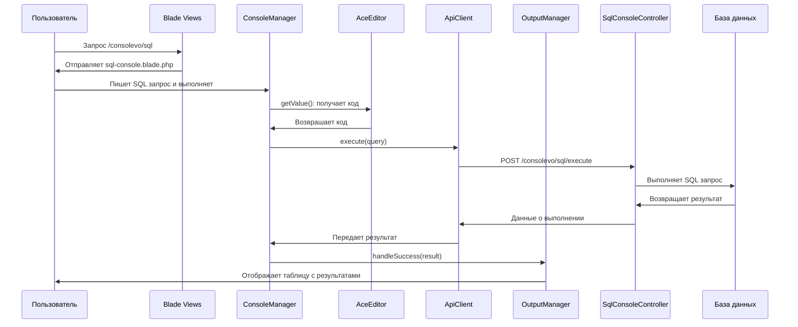

# SqlConsoleController

## Назначение
Контроллер для работы с SQL консолью в системе Consolevo. Предоставляет безопасный интерфейс для выполнения SQL запросов к базе данных Evolution CMS с автоматическим добавлением префиксов таблиц, валидацией и защитой от опасных операций.

## Схема работы SQL-консоли



## Класс
**Пространство имен:** `roilafx\Consolevo\Controllers`

**Имя класса:** `SqlConsoleController`

## Зависимости
- `Illuminate\Http\Request` - обработка HTTP запросов
- `Illuminate\Http\JsonResponse` - форматирование JSON ответов
- `Illuminate\Support\Facades\DB` - работа с базой данных
- `Illuminate\Database\QueryException` - обработка исключений БД
- `DocumentParser` (Evolution CMS) - доступ к системным функциям

## Конструктор

### __construct()
**Инициализирует:** объект Evolution CMS (`DocumentParser`)
```php
public function __construct()
{
    $this->evo = evolutionCMS();
}
```

## Публичные методы

### index()
**Маршрут:** `GET /consolevo/sql`

**Имя маршрута:** `consolevo.sql`

**Назначение:** Отображение интерфейса SQL консоли.

**Возвращает:**
- `Illuminate\View\View` - представление SQL консоли

**Используемое представление:**
- `consolevo::sql-console` - Blade шаблон интерфейса SQL консоли

### execute(Request $request): JsonResponse
**Маршрут:** `POST /consolevo/sql/execute`

**Имя маршрута:** `consolevo.sql.execute`

**Назначение:** Выполнение SQL запроса с валидацией и обработкой результатов.

**Параметры:**
- `Request $request` - HTTP запрос с данными

**Входные данные (JSON/Form):**
```json
{
    "query": "SELECT * FROM site_content"
}
```

**Логика работы:**
1. Проверка на пустой запрос
2. Добавление префиксов к именам таблиц
3. Валидация синтаксиса и безопасности
4. Определение типа запроса
5. Выполнение с замером времени
6. Форматирование результатов

**Успешный ответ:**
```json
{
    "success": true,
    "data": [...],
    "count": 10,
    "affected_rows": 0,
    "execution_time": 0.0456,
    "query_type": "SELECT",
    "table_prefix": "modx_",
    "query_info": "Найдено записей: 10"
}
```

**Ошибка валидации (400):**
```json
{
    "success": false,
    "error": "Сообщение об ошибке",
    "query_type": "ERROR",
    "table_prefix": "modx_"
}
```

**Ошибка выполнения (500):**
```json
{
    "success": false,
    "error": "Ошибка базы данных: детали ошибки",
    "query_type": "ERROR",
    "table_prefix": "modx_"
}
```

### getTablesForAutocomplete(): JsonResponse
**Маршрут:** `GET /consolevo/sql/tables`

**Назначение:** Получение списка таблиц и их структуры для автодополнения в SQL редакторе.

**Успешный ответ:**
```json
{
    "success": true,
    "tables": [
        {
            "name": "modx_site_content",
            "clean_name": "site_content",
            "prefixed": true
        }
    ],
    "table_structures": {
        "site_content": [
            {
                "field": "id",
                "type": "int(11)",
                "caption": "Key: PRI"
            }
        ]
    },
    "table_prefix": "modx_"
}
```

**Ошибка:**
```json
{
    "success": false,
    "error": "Не удалось получить список таблиц: детали ошибки"
}
```

## Приватные методы

### Вспомогательные методы

#### getTablePrefix(): string
**Назначение:** Определение префикса таблиц в базе данных.

**Логика:** Извлекает префикс из полного имени таблицы `site_content`.

**Пример:**
```php
// Если полное имя: modx_site_content
// Возвращает: "modx_"
```

#### addTablePrefix(string $query): string
**Назначение:** Автоматическое добавление префиксов к именам таблиц в SQL запросе.

**Параметры:**
- `string $query` - исходный SQL запрос

**Возвращает:**
- `string` - SQL запрос с добавленными префиксами

**Пример:**
```php
// Вход: SELECT * FROM site_content
// Выход: SELECT * FROM modx_site_content
```

**Алгоритм:**
1. Получение списка всех таблиц в БД
2. Для каждой таблицы:
   - Извлечение "чистого" имени (без префикса)
   - Замена чистого имени на полное в запросе

### Методы валидации

#### validateQuery(string $query): array
**Назначение:** Комплексная валидация SQL запроса.

**Параметры:**
- `string $query` - SQL запрос для валидации

**Возвращает:**
```php
[
    'valid' => bool,    // true если запрос валиден
    'error' => string,  // сообщение об ошибке
    'type' => string    // тип запроса (SELECT, INSERT и т.д.)
]
```

**Проверки:**
1. Пустой запрос
2. Синтаксис SQL (баланс кавычек и скобок)
3. Критические угрозы безопасности

#### checkCriticalDangers(string $query): array
**Назначение:** Проверка на критически опасные SQL операции.

**Параметры:**
- `string $query` - SQL запрос для проверки

**Возвращает:**
```php
[
    'safe' => bool,    // true если безопасно
    'reason' => string // причина блокировки
]
```

**Блокируемые операции:**
1. `DROP DATABASE` - удаление базы данных
2. `INTO OUTFILE/DUMPFILE` с системными путями
3. `KILL`, `SHUTDOWN`, `RESTART` - опасные команды

**Пример опасного запроса:**
```sql
SELECT * INTO OUTFILE '/etc/passwd' FROM users
```

#### getQueryType(string $query): string
**Назначение:** Определение типа SQL запроса.

**Параметры:**
- `string $query` - SQL запрос

**Возвращает:**
- `string` - тип запроса в верхнем регистре (SELECT, INSERT, UPDATE и т.д.)

**Логика:** Извлекает первое слово из запроса.

#### validateSqlSyntax(string $query): bool
**Назначение:** Базовая проверка синтаксиса SQL.

**Параметры:**
- `string $query` - SQL запрос

**Возвращает:**
- `bool` - true если синтаксис корректен

**Проверки:**
1. Баланс одинарных, двойных кавычек и обратных апострофов
2. Баланс круглых скобок

#### checkBalancedQuotes(string $query): bool
**Назначение:** Проверка баланса кавычек в SQL запросе.

**Логика:** Убеждается, что все кавычки закрыты.

#### checkBalancedParentheses(string $query): bool
**Назначение:** Проверка баланса скобок в SQL запросе.

**Логика:** Сравнивает количество открывающих и закрывающих скобок.

### Методы выполнения запросов

#### executeQuery(string $query, string $queryType): array
**Назначение:** Выполнение SQL запроса с учетом его типа.

**Параметры:**
- `string $query` - SQL запрос с префиксами
- `string $queryType` - тип запроса

**Возвращает:**
```php
[
    'data' => array,         // данные результата
    'count' => int,          // количество записей
    'affected_rows' => int,  // затронутые строки
    'last_insert_id' => int, // ID последней вставки (для INSERT)
    'ddl_operation' => bool  // флаг DDL операции
]
```

**Обработка по типам:**

1. **SELECT/SHOW/DESCRIBE/EXPLAIN:**
   - Использует `DB::select()`
   - Возвращает данные результата
   - `affected_rows = 0`

2. **INSERT/UPDATE/DELETE/REPLACE:**
   - Использует `DB::affectingStatement()`
   - Возвращает количество затронутых строк
   - Для INSERT дополнительно возвращает `last_insert_id`

3. **CREATE/ALTER/DROP/TRUNCATE (DDL):**
   - Использует `DB::statement()`
   - Устанавливает флаг `ddl_operation = true`

**Ограничения:**
- `set_time_limit(30)` - лимит выполнения 30 секунд

### Методы формирования ответов

#### successResponse(array $result, string $queryType, float $executionTime, string $originalQuery): JsonResponse
**Назначение:** Формирование успешного JSON ответа.

**Параметры:**
- `array $result` - результат выполнения запроса
- `string $queryType` - тип запроса
- `float $executionTime` - время выполнения в секундах
- `string $originalQuery` - исходный запрос (для логов)

**Возвращает:**
- `JsonResponse` - форматированный JSON ответ

**Структура ответа:**
```json
{
    "success": true,
    "data": [],
    "count": 0,
    "affected_rows": 0,
    "execution_time": 0.123,
    "query_type": "SELECT",
    "table_prefix": "modx_",
    "last_insert_id": 123,      // только для INSERT
    "ddl_operation": true,      // только для DDL
    "query_info": "Информация о выполнении"
}
```

#### errorResponse(string $message, int $code = 400): JsonResponse
**Назначение:** Формирование ответа с ошибкой.

**Параметры:**
- `string $message` - сообщение об ошибке
- `int $code` - HTTP код ошибки (по умолчанию 400)

**Возвращает:**
- `JsonResponse` - JSON ответ с ошибкой

#### getQueryInfo(string $queryType, array $result): string
**Назначение:** Генерация информационного сообщения о выполнении запроса.

**Параметры:**
- `string $queryType` - тип запроса
- `array $result` - результат выполнения

**Возвращает:**
- `string` - информационное сообщение

**Примеры сообщений:**
- SELECT: "Найдено записей: 10"
- INSERT: "Добавлено записей: 1, ID новой записи: 123"
- UPDATE: "Обновлено записей: 5"
- DDL: "Операция DDL выполнена успешно"

#### formatSqlError(string $error): string
**Назначение:** Очистка и форматирование сообщений об ошибках SQL.

**Параметры:**
- `string $error` - исходное сообщение об ошибке

**Возвращает:**
- `string` - очищенное сообщение об ошибке

**Удаляет:**
- Префиксы `SQLSTATE[...]:`
- Информацию о подключении в скобках

**Пример:**
```php
// Вход: SQLSTATE[42000]: Syntax error: 1064 ... (Connection: mysql, SQL: ...)
// Выход: Syntax error: 1064 ...
```

## Безопасность

### Уровни защиты

1. **Middleware:**
   - `VerifyCsrfToken` - защита от CSRF
   - `ConsolevoAccess` - контроль доступа

2. **Валидация запросов:**
   - Проверка на пустые запросы
   - Баланс кавычек и скобок
   - Блокировка опасных операций

3. **Автоматическое добавление префиксов:**
   - Предотвращает ошибки с именами таблиц
   - Изолирует системные таблицы

4. **Ограничение времени выполнения:**
   - `set_time_limit(30)` для всех запросов

5. **Безопасное выполнение:**
   - Использование подготовленных выражений через Laravel Query Builder
   - Обработка всех исключений
   - Ограничение вывода данных

### Опасные операции (блокируются)

1. **Удаление базы данных:**
   ```sql
   DROP DATABASE database_name
   ```

2. **Экспорт в системные файлы:**
   ```sql
   SELECT * INTO OUTFILE '/etc/passwd'
   SELECT * INTO DUMPFILE '/root/backup.sql'
   ```

3. **Системные команды MySQL:**
   ```sql
   KILL [process_id]
   SHUTDOWN
   RESTART
   ```

## Производительность

### Метрики сбора
1. **Время выполнения:** точность до 4 знаков после запятой
2. **Количество записей:** для SELECT запросов
3. **Затронутые строки:** для INSERT/UPDATE/DELETE
4. **Идентификатор вставки:** для INSERT запросов

### Оптимизации
1. **Кэширование структуры таблиц:** в методе автодополнения
2. **Эффективная замена префиксов:** один проход по всем таблицам

## Обработка ошибок

### Типы ошибок

1. **Ошибки валидации:**
   - Пустые запросы
   - Несбалансированные кавычки/скобки
   - Обнаруженные опасные операции

2. **Ошибки базы данных (`QueryException`):**
   - Синтаксические ошибки SQL
   - Ошибки доступа к таблицам
   - Нарушения ограничений

3. **Общие исключения (`Exception`):**
   - Проблемы с подключением к БД
   - Таймауты выполнения
   - Другие системные ошибки

### Форматирование ошибок
- Удаление технической информации из сообщений SQL
- Сохранение только сути ошибки
- Единый формат для всех типов ошибок

## Примеры использования

### 1. Простой SELECT запрос
```php
// Запрос:
SELECT id, pagetitle FROM site_content WHERE published = 1 LIMIT 5

// Ответ:
{
    "success": true,
    "data": [
        {"id": 1, "pagetitle": "Главная"},
        {"id": 2, "pagetitle": "О компании"}
    ],
    "count": 2,
    "affected_rows": 0,
    "execution_time": 0.0234,
    "query_type": "SELECT",
    "table_prefix": "modx_",
    "query_info": "Найдено записей: 2"
}
```

### 2. INSERT запрос
```php
// Запрос:
INSERT INTO site_content (pagetitle, published) VALUES ('Новая страница', 1)

// Ответ:
{
    "success": true,
    "data": [],
    "count": 0,
    "affected_rows": 1,
    "execution_time": 0.0456,
    "query_type": "INSERT",
    "table_prefix": "modx_",
    "last_insert_id": 125,
    "query_info": "Добавлено записей: 1, ID новой записи: 125"
}
```

### 3. Ошибка синтаксиса
```php
// Запрос:
SELECT * FRM site_content

// Ответ:
{
    "success": false,
    "error": "Ошибка базы данных: You have an error in your SQL syntax",
    "query_type": "ERROR",
    "table_prefix": "modx_"
}
```

### 4. Получение структуры таблиц
```php
// Запрос к: GET /consolevo/sql/tables
// Ответ:
{
    "success": true,
    "tables": [
        {
            "name": "modx_site_content",
            "clean_name": "site_content",
            "prefixed": true
        },
        {
            "name": "modx_site_templates",
            "clean_name": "site_templates",
            "prefixed": true
        }
    ],
    "table_structures": {
        "site_content": [
            {"field": "id", "type": "int(11)", "caption": "Key: PRI"},
            {"field": "pagetitle", "type": "varchar(255)", "caption": ""}
        ]
    },
    "table_prefix": "modx_"
}
```

## Ограничения

### Технические ограничения
1. **Только MySQL:** методы используют MySQL-специфичные команды (`SHOW TABLES`, `DESCRIBE`)
2. **Префиксы таблиц:** предполагается, что все таблицы имеют единый префикс
3. **Время выполнения:** максимально 30 секунд на запрос
4. **Память:** ограничения PHP memory_limit применяются

### Функциональные ограничения
1. **Нет поддержки хранимых процедур**
2. **Нет выполнения нескольких запросов за раз**
3. **Ограниченная информация о структуре БД**
4. **Нет визуализации планов выполнения**