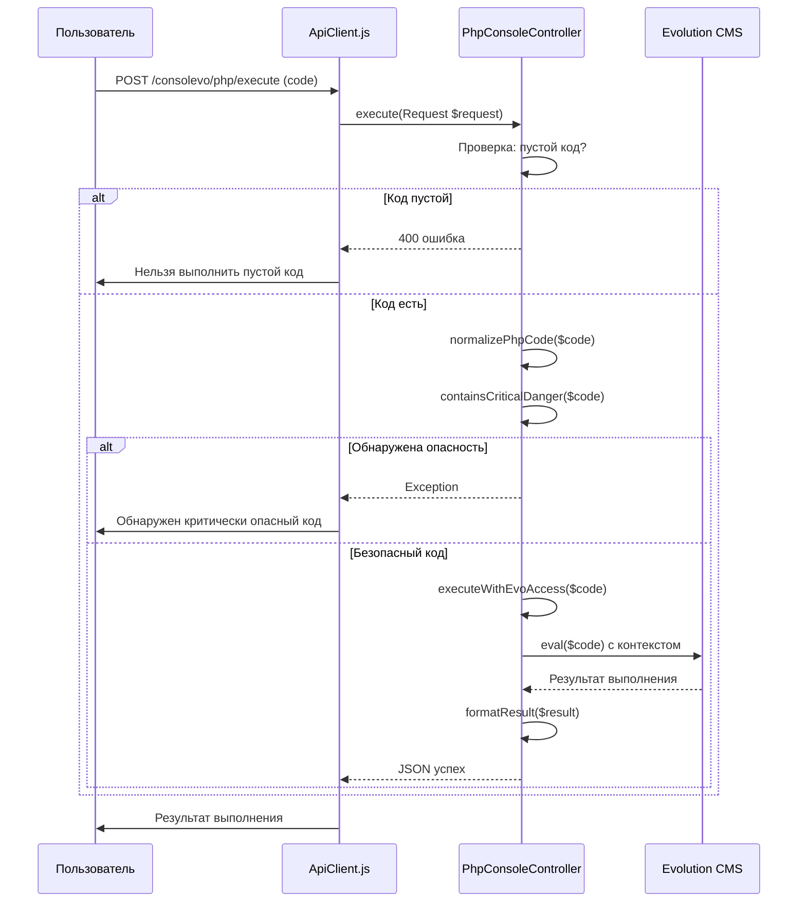
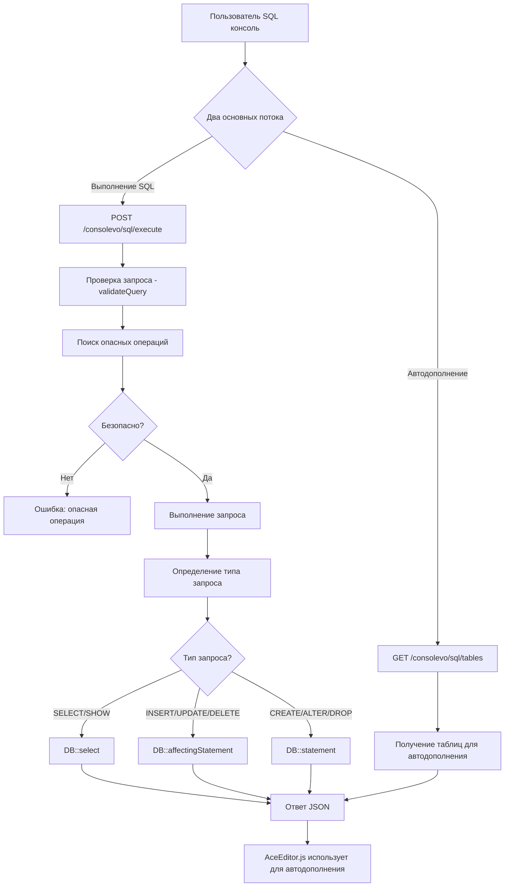

# Общая схема контроллеров

```text
┌─────────────────────────────────────────────────────────────┐
│                         КОНТРОЛЛЕРЫ                         │
├─────────────────────────────────────────────────────────────┤
│  ConsoleController                                          │
│  ├── Роль: Главная страница (дашборд)                       │
│  ├── Метод: index() → view('consolevo::console')            │
│  └── Маршрут: GET /consolevo                                │
├─────────────────────────────────────────────────────────────┤
│  PhpConsoleController                                       │
│  ├── Роль: Выполнение PHP кода                              │
│  ├── index() → PHP консоль UI                               │
│  ├── execute() → Выполнение PHP кода с безопасностью        │
│  ├── Маршруты:                                              │
│  │   ├── GET /consolevo/php                                 │
│  │   └── POST /consolevo/php/execute                        │
│  └── Ключевые функции:                                      │
│      - executeAsManager() → Безопасное выполнение           │
│      - containsCriticalDanger() → Проверка опасного кода    │
│      - executeWithEvoAccess() → Доступ к Evolution CMS      │
├─────────────────────────────────────────────────────────────┤
│  SqlConsoleController                                       │
│  ├── Роль: Выполнение SQL запросов                          │
│  ├── index() → SQL консоль UI                               │
│  ├── execute() → Выполнение SQL с валидацией                │
│  ├── getTablesForAutocomplete() → Структура БД для подсказок│
│  ├── Маршруты:                                              │
│  │   ├── GET /consolevo/sql                                 │
│  │   ├── POST /consolevo/sql/execute                        │
│  │   └── GET /consolevo/sql/tables                          │
│  └── Ключевые функции:                                      │
│      - addTablePrefix() → Добавление префиксов              │
│      - validateQuery() → Валидация SQL запроса              │
│      - checkCriticalDangers() → Проверка опасных операций   │
├─────────────────────────────────────────────────────────────┤
│  AnalysisController                                         │
│  ├── Роль: Анализ Evolution CMS для автодополнения          │
│  ├── getUnifiedData() → Данные классов и методов Evo CE     │
│  ├── Маршрут: GET /consolevo/analysis/unified-data          │
│  └── Интеграция: EvoAnalyzer → Анализ исходного кода Evo CE │
└─────────────────────────────────────────────────────────────┘
```

## Базовый URL
Все эндпоинты доступны по префиксу: /consolevo

## Стартовый контроллер (ConsoleController)

Просто возврашает нужную общую страницу.

## Выполнение PHP (PhpConsoleController)



### containsCriticalDanger

**Проверка критически опасных операций:**
   - Системные функции: eval, exec, system, shell_exec и т.д.
   - Опасные файловые операции с ../ путями
   - Сетевые операции с внешними адресами
   - Изменение критических настроек PHP
   - Создание файлов в системных путях

### Пример ответа PHP

```json
{
    "success": true,
    "output": "Результат выполнения",
    "result": "Форматированный результат",
    "execution_time": 0.1234,
    "memory_usage": 1024000
}
```

## Выполнение SQL (SqlConsoleController)



### validateQuery

1. Проверка пустого запроса
2. Синтаксическая проверка:
   • Баланс кавычек (', ", `)
   • Баланс скобок
3. Проверка опасных операций:
   • DROP DATABASE
   • INTO OUTFILE/DUMPFILE с системными путями
   • KILL, SHUTDOWN, RESTART
4. Автоматическое добавление префиксов таблиц
5. Определение типа запроса (SELECT, INSERT, и т.д.)

### Пример ответа SQL 

```json
{
    "success": true,
    "tables": [
        {"name": "modx_site_content", "clean_name": "site_content"},
        {"name": "modx_site_tmplvars", "clean_name": "site_tmplvars"}
    ],
    "table_structures": {
        "site_content": [
            {"field": "id", "type": "int(11)", "caption": "Key: PRI"}
        ]
    }
}
```

## Архитектура маршрутов

### Структура маршрутов

```
/consolevo/
├── /                    (GET)      ConsoleController@index
├── /php                (GET)      PhpConsoleController@index
├── /php/execute        (POST)     PhpConsoleController@execute
├── /sql                (GET)      SqlConsoleController@index
├── /sql/execute        (POST)     SqlConsoleController@execute
├── /sql/tables         (GET)      SqlConsoleController@getTablesForAutocomplete
└── /analysis/unified-data (GET)  AnalysisController@getUnifiedData
```

### Группа маршрутов Consolevo

Все маршруты сгруппированы с общими настройками:

**Префикс:** consolevo
**Middleware:** 
1. VerifyCsrfToken - для всех POST запросов
2. ConsolevoAccess - проверка прав доступа

### Назначение маршрутов

1. **Главная страница** (`/`)
   - Отображение основной панели консоли

2. **PHP консоль** (`/php`, `/php/execute`)
   - Интерфейс PHP консоли
   - Выполнение PHP кода

3. **SQL консоль** (`/sql`, `/sql/execute`, `/sql/tables`)
   - Интерфейс SQL консоли
   - Выполнение SQL запросов
   - Получение списка таблиц для автодополнения

4. **Анализ данных** (`/analysis/unified-data`)
   - Получение данных для автодополнения
   - Динамический анализ кодовой базы
