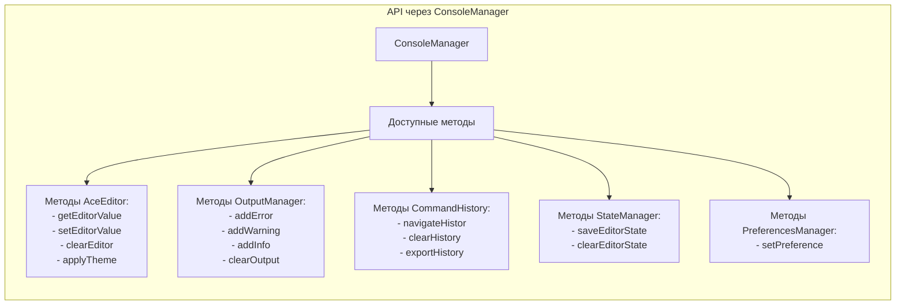

# ConsoleManager.js

**Роль:** Фасад-паттерн для координации всех модулей

## Ключевые методы и их назначение:

1. Инициализация:
    - init() - основной метод инициализации
    - initializeModules() - последовательная загрузка модулей
    - setupFacadeMethods() - создание удобного API

2. Работа с кодом:
    - executeCode() - выполнение кода (PHP/SQL)
    - navigateHistory() - навигация по истории команд

3. UI управление:
    - updateExecuteButtonState() - состояние кнопки выполнения
    - showExecutionIndicator() - индикатор прогресса
    - updateStatistics() - обновление статистики

4. Сохранение состояния:
    - saveEditorState() - сохранение состояния редактора
    - restoreEditorState() - восстановление состояния

5. Управление настройками:
    - applyTheme() - применение темы
    - loadAndApplyPreferences() - загрузка настроек

### Зависимости модулей

```text
ConsoleManager
├── PreferencesManager (настройки пользователя)
├── StateManager (сохранение состояния)
├── OutputManager (управление выводом)
├── ApiClient (коммуникация с сервером)
├── AceEditor (редактор кода)
├── CommandHistory (история команд)
└── HistoryModal (модальное окно истории)
```

Поток выполнения executeCode():
1. Проверка на уже выполняющийся код
2. Валидация входного кода
3. Обновление UI (кнопки, индикатор)
4. Сохранение состояния редактора
5. Добавление в историю
6. Выполнение через ApiClient
7. Обработка результата (успех/ошибка)
8. Обновление статистики
9. Восстановление UI состояния



## Основные методы подробней

### 1. Инициализация и жизненный цикл

| Метод | Назначение | Особенности |
|-------|------------|-------------|
| `init()` | Основная точка входа для инициализации | Асинхронный, обрабатывает критические ошибки |
| `initializeModules()` | Последовательная инициализация всех модулей | Строгий порядок инициализации, обработка ошибок на каждом этапе |
| `setupFacadeMethods()` | Создание публичного API для модулей | Привязывает методы модулей к фасаду, обеспечивая удобный доступ |
| `destroy()` | Очистка ресурсов и остановка модулей | Вызывает `destroy()` у всех модулей, сохраняет состояние перед выходом |

### 2. Управление выполнением кода

| Метод | Назначение | Параметры | Возвращает |
|-------|------------|-----------|------------|
| `executeCode()` | Выполнение кода из редактора | - | `Promise<void>` |
| `navigateHistory(direction)` | Навигация по истории команд | `direction: number` (1/-1) | `void` |


### 3. Управление состоянием UI

| Метод | Назначение | Эффекты |
|-------|------------|---------|
| `updateExecuteButtonState(isExecuting)` | Управление состоянием кнопок выполнения | Блокировка/разблокировка, смена текста, добавление спиннера |
| `showExecutionIndicator(show)` | Показ/скрытие индикатора выполнения | Анимированное появление/исчезновение |
| `updateExecutionProgress(progress)` | Обновление прогресс-бара | `progress: 0-100`, анимация изменения |
| `updateStatistics(data)` | Обновление статистики выполнения | Форматирование времени и использования памяти |

### 4. Работа с состоянием приложения

| Метод | Назначение | Сохраняемые данные |
|-------|------------|-------------------|
| `saveEditorState()` | Сохранение текущего состояния | Код, позиция курсора, выделения, тип консоли |
| `restoreEditorState()` | Восстановление состояния | Асинхронное восстановление из localStorage |
| `clearEditorState()` | Очистка сохраненного состояния | Удаление из localStorage |

### 5. Управление настройками

| Метод | Назначение | Влияние |
|-------|------------|---------|
| `applyTheme(themeId)` | Применение темы редактора | Изменение темы AceEditor, сохранение в настройках |
| `setPreference(key, value)` | Установка настройки | Сохранение в PreferencesManager |
| `loadAndApplyPreferences()` | Загрузка и применение настроек | Автоматически при инициализации |

### 6. Управление данными

| Метод | Назначение | Область действия |
|-------|------------|-----------------|
| `clearOutput()` | Очистка вывода консоли | OutputManager |
| `clearEditor()` | Очистка редактора кода | AceEditor |
| `clearHistory()` | Очистка истории команд | CommandHistory |
| `clearAll()` | Полная очистка всех данных | Все модули (редактор, вывод, история, состояние) |

### 7. Работа с историей

| Метод | Назначение | Взаимодействие |
|-------|------------|----------------|
| `showHistory()` | Отображение модального окна истории | История → HistoryModal → UI |
| `exportHistory()` | Экспорт истории команд | CommandHistory → файл |

### 8. Фасадные методы для модулей

**Редактор (AceEditor):**
- `getEditorValue()` → `editor.getValue()`
- `setEditorValue(value)` → `editor.setValue(value)`
- `clearEditor()` → `editor.clear()`

**Вывод (OutputManager):**
- `addError(message, context)` → `output.addError()`
- `addWarning(message, context)` → `output.addWarning()`
- `addInfo(message, isHtml)` → `output.add()`
- `addSuccess(message, isHtml)` → `output.add()`
- `clearOutput()` → `output.clear()`

**История (CommandHistory):**
- `clearHistory()` → `history.clear()`
- `exportHistory()` → `history.export()`

**Состояние (StateManager):**
- `saveEditorState()` → `state.saveState()`
- `clearEditorState()` → `state.clearState()`

## Примеры

### DOM события (обработчики)
```javascript
// Основные кнопки
executeBtn.click        → executeCode()
executeEditorBtn.click  → executeCode()
clearConsoleBtn.click   → clearOutput()
clearEditorBtn.click    → clearEditor()
showHistoryBtn.click    → showHistory()

// Настройки редактора
themeSelector.change    → applyTheme()
fontSizeSelector.change → editor.changeFontSize()
wrapModeToggle.change   → editor.toggleWrapMode()
```

### Кастомные события
```javascript
// HistoryModal события
historyModal.onUseCommand → setEditorValue(command)

// Внутренние события
beforeExecute → validation, UI updates
afterExecute  → statistics, result processing
onError       → error handling, UI recovery
```

### Базовое использование
```javascript
const consoleManager = new ConsoleManager({
    executeRoute: '/api/execute-php',
    consoleType: 'php'
});

await consoleManager.init();
```

### Расширенное использование
```javascript
// Программное выполнение кода
consoleManager.setEditorValue('<?php echo "Hello"; ?>');
await consoleManager.executeCode();

// Управление интерфейсом
consoleManager.applyTheme('monokai');
consoleManager.showHistory();

// Очистка данных
consoleManager.clearAll();
```

### Обработка событий
```javascript
// Подписка на изменения редактора (пример расширения)
const originalSetValue = consoleManager.setEditorValue;
consoleManager.setEditorValue = function(value) {
    console.log('Editor value changed:', value.substring(0, 50));
    return originalSetValue.call(this, value);
};
```

## Конфигурация

### Параметры конструктора
```typescript
interface ConsoleManagerConfig {
    executeRoute: string;    // URL endpoint для выполнения кода
    consoleType: 'php' | 'sql';  // Тип консоли (определяет логику)
}
```