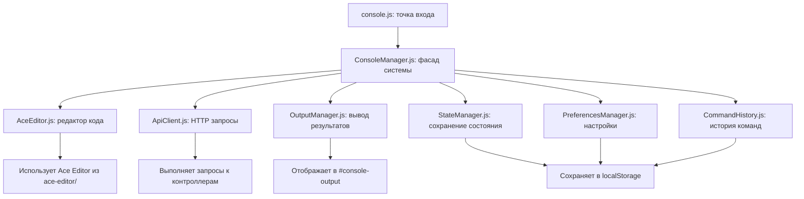

# В общем о JS

Веб-консоль для выполнения PHP и SQL кода прямо в браузере. Система предоставляет полноценную среду разработки с подсветкой синтаксиса, автодополнением, историей команд и интеллектуальным выводом результатов.

## Устройство JS 

*Без **HistoryModal** он просто показывает историю*



## Основные возможности

### Для PHP консоли:
- Выполнение произвольного PHP кода
- Автодополнение методов Evolution CMS (`$modx`, `$evo`)
- Поддержка сниппетов (snippets)
- Отображение результатов выполнения и ошибок
- Замер времени выполнения и использования памяти

### Для SQL консоли:
- Выполнение SQL запросов к базе данных
- Интеллектуальное автодополнение таблиц и колонок
- Отображение результатов в табличном формате
- Контекстные подсказки (keywords, functions)
- Статистика затронутых строк и времени выполнения

### Общие возможности:
- Настраиваемая тема редактора (dark/light темы)
- Регулировка размера шрифта
- Сохранение состояния между сессиями
- История команд с поиском
- Асинхронное выполнение с индикацией прогресса
- Безопасность (CSRF защита, экранирование HTML)

### Ключевые паттерны:
- **Фасад** (ConsoleManager) — единый интерфейс для всей системы
- **Observer** — событийная модель через DOM события
- **Singleton-like** — централизованное управление модулями
- **Mediator** — взаимодействие между независимыми модулями

## Использование API

### Инициализация:
```javascript
const consoleManager = new ConsoleManager(config);
await consoleManager.init();
```

### Основные методы:
```javascript
// Выполнение кода
await consoleManager.executeCode();

// Управление историей
consoleManager.showHistory();
consoleManager.navigateHistory(-1); // Назад по истории

// Работа с редактором
consoleManager.setEditorValue('<?php echo "Hello"; ?>');
consoleManager.clearEditor();

// Управление настройками
consoleManager.applyTheme('ace/theme/monokai');
consoleManager.clearAll();
```

## Модули системы

### Схема связей JS

```mermaid
graph TB
    %% Точка входа системы
    ENTRY[console.js<br/>Точка входа] --> CM
    
    %% Фасад/Координатор - ядро системы
    subgraph "CORE: ConsoleManager (Фасад)"
        CM[ConsoleManager<br/>• Координирует все модули<br/>• Обрабатывает UI события<br/>• Управляет выполнением кода]
    end
    
    %% Модули первого уровня - напрямую вызываются из ConsoleManager
    CM --> AE
    CM --> APIC
    CM --> OM
    CM --> SM
    CM --> PM
    CM --> CH
    
    %% Модуль редактора кода
    subgraph "EDITOR: AceEditor"
        AE[AceEditor<br/>• Управление редактором кода<br/>• Автодополнение<br/>• Сниппеты]
        
        AE --> ACE_DEPS[ACE Editor Dependencies<br/>• ace.js<br/>• mode-*.js<br/>• theme-*.js<br/>• snippets/*.js]
    end
    
    %% Модуль API клиента
    APIC[ApiClient<br/>• HTTP запросы к серверу<br/>• Повторы и таймауты<br/>• Валидация ответов] --> HELPERS
    
    %% Модуль вывода
    OM[OutputManager<br/>• Отображение результатов<br/>• Форматирование вывода<br/>• Таблицы SQL] --> HELPERS
    
    %% Модуль состояния
    SM[StateManager<br/>• Сохранение состояния редактора<br/>• LocalStorage<br/>• Восстановление] --> HELPERS
    
    %% Модуль настроек
    PM[PreferencesManager<br/>• Настройки пользователя<br/>• Тема, шрифт, wrap mode<br/>• Сохранение в localStorage] --> HELPERS
    
    %% Модуль истории
    CH[CommandHistory<br/>• История выполненных команд<br/>• Навигация по истории<br/>• Поиск] --> HELPERS
    
    %% Вспомогательные утилиты
    subgraph "UTILS: Вспомогательные модули"
        HELPERS[helpers.js<br/>• Форматирование<br/>• Безопасность<br/>• Валидация<br/>• Дебаунс/Троттлинг]
        
        CONSTANTS[constants.js<br/>• Конфигурация<br/>• Селекторы DOM<br/>• Константы тем/режимов]
        
        COMPLETION[completion-data.js<br/>• Данные автодополнения SQL<br/>• Ключевые слова SQL<br/>• Функции SQL]
        
        ANALYZE_EVO[analyze-evo.js<br/>• Запрос данных Evo CMS<br/>• Генерация автодополнения PHP]
    end
    
    %% Взаимодействия между модулями
    AE -.->|Использует для автодополнения| COMPLETION
    AE -.->|Использует для PHP автодополнения| ANALYZE_EVO
    AE -.->|Использует константы| CONSTANTS
    AE -.->|Использует помощников| HELPERS
    
    APIC -.->|Использует константы| CONSTANTS
    APIC -.->|Использует CSRF токен| HELPERS
    
    OM -.->|Использует константы промптов| CONSTANTS
    OM -.->|Использует форматирование| HELPERS
    
    SM -.->|Использует конфигурацию| CONSTANTS
    SM -.->|Использует safeJsonParse| HELPERS
    
    PM -.->|Использует схему настроек| CONSTANTS
    PM -.->|Использует безопасный парсинг| HELPERS
    
    CH -.->|Использует дебаунс| HELPERS
    CH -.->|Использует фильтрацию| HELPERS
    
    %% Взаимодействие с бэкендом
    APIC -->|HTTP запросы| BACKEND[Бэкенд контроллеры]
    
    ANALYZE_EVO -->|GET /analysis/unified-data| ACONTROLLER[AnalysisController]
    
    COMPLETION -.->|Использует данные от| SQL_CONTROLLER[SqlConsoleController]
    
    %% DOM элементы и события
    CM -->|Управляет| DOM[DOM элементы<br/>• #code-editor<br/>• #console-output<br/>• Кнопки управления<br/>• Селекторы настроек]
    
    DOM -->|События пользователя| CM
    
    %% Потоки данных между модулями
    subgraph "DATA FLOWS BETWEEN MODULES"
        AE -->|getValue → код| CM
        CM -->|код → execute| APIC
        APIC -->|результат → handleSuccess| OM
        SM -->|сохраненное состояние → restoreToEditor| AE
        PM -->|настройки → applyPreferences| AE
        CH -->|команда из истории → setEditorValue| AE
    end
```



### 1. **ConsoleManager** (Фасад)
Центральный координатор, управляющий всеми модулями:
- Последовательная инициализация
- Единый публичный API
- Обработка ошибок и восстановление

### 2. **AceEditor** (Редактор кода)
Обертка над Ace Editor с расширенными возможностями:
- Подсветка синтаксиса PHP/SQL
- Контекстное автодополнение
- Сохранение позиции курсора и выделений
- Поддержка тем и настроек

### 3. **ApiClient** (HTTP клиент)
Умный клиент для выполнения кода на сервере:
- Повторные попытки при ошибках (retry)
- Обработка таймаутов
- Валидация ответов
- Поддержка HTML ошибок Evolution CMS

### 4. **OutputManager** (Вывод)
Управление отображением результатов:
- Структурированный вывод ошибок
- Табличное отображение SQL результатов
- Ограничение количества строк
- Автоматическая прокрутка

### 5. **PreferencesManager** (Настройки)
Управление пользовательскими настройками:
- Сохранение в localStorage
- Валидация по схеме
- Импорт/экспорт настроек

### 6. **StateManager** (Состояние)
Сохранение и восстановление состояния редактора:
- Автосохранение с debounce
- Контроль версий формата
- Ограничение размера данных

### 7. **CommandHistory** (История)
Управление историей выполненных команд:
- Навигация стрелками
- Поиск по истории
- Ограничение размера

### 8. **HistoryModal** (Интерфейс)
Модальное окно для работы с историей:
- Поиск и фильтрация
- Использование старых команд
- Очистка истории

## Настройка и кастомизация

### Темы редактора:
```javascript
// Доступные темы
const themes = [
    'ace/theme/tomorrow_night',  // По умолчанию (темная)
    'ace/theme/monokai',         // Популярная темная
    'ace/theme/github',          // Светлая
    'ace/theme/chrome'           // Светлая Chrome-style
];

// Установка темы
consoleManager.applyTheme('ace/theme/monokai');
```

### Конфигурация через константы:
```javascript
// В utils/constants.js
EDITOR_CONFIG, THEMES, MODES, API_CONFIG,
DEFAULT_PREFERENCES, PREFERENCES_SCHEMA,
STATE_CONFIG, MODULES_CONFIG, PROMPT_SYMBOLS
```

## Безопасность

### Встроенные механизмы:
1. **CSRF защита** — автоматическое получение токенов
2. **HTML экранирование** — безопасный вывод пользовательского контента
3. **Валидация JSON** — безопасный парсинг данных
4. **Ограничение размера** — защита от DoS атак
5. **Экранирование SQL** — безопасные идентификаторы

### Рекомендации по безопасности:
```javascript
// Всегда используйте
escapeHtml(userInput);      // Для вывода текста
sanitizeHtml(trustedHtml);  // Для безопасного HTML
safeJsonParse(untrusted);   // Для парсинга JSON
```

## Производительность

### Оптимизации:
- **Debounce/throttle** для частых операций
- **Ограничение вывода** (1000 строк максимум)
- **Ленивая загрузка** данных автодополнения
- **Кэширование** в localStorage

### Мониторинг:
```javascript
// Метрики доступны через
consoleManager.modules.state.getStateInfo();
consoleManager.modules.history.getStats();
```

## Отладка и логгирование

### Встроенный логгер:
```javascript
// Во всех модулях
this.log.info('Сообщение', { данные });
this.log.warn('Предупреждение', { контекст });
this.log.error('Ошибка', { error: error.message });
this.log.debug('Отладочная информация', { details });
```

### Глобальный доступ:
```javascript
// В браузерной консоли
window.consoleManager           // Главный объект
window.consoleManager.modules  // Все модули
window.consoleManager.destroy() // Принудительная очистка
```

## Интеграция с Evolution CMS

### Автодополнение для Evolution CMS:
- Динамическая загрузка методов `$modx`, `$evo`
- Сниппеты для популярных функций
- Константы и свойства системы

### API для интеграции:
```javascript
// Загрузка данных структуры CMS
const analysis = await analyzeEvolutionCMS();

// Генерация автодополнений
const completions = generateEvoCompletionsFromAnalysis(analysis);
const snippets = generateEvoSnippetsFromAnalysis(analysis);
```

## Обработка ошибок

### Уровни обработки:
1. **Валидация** — проверка перед выполнением
2. **Сеть** — повторные попытки и таймауты
3. **Сервер** — обработка ошибок выполнения
4. **Клиент** — восстановление после сбоев

### Пример обработки:
```javascript
try {
    await consoleManager.executeCode();
} catch (error) {
    if (error.isHtmlError) {
        // Обработка HTML ошибок Evolution CMS
        consoleManager.handleEvolutionError(error.htmlContent);
    } else {
        consoleManager.addError(error.message, 'Выполнение');
    }
}
```

## Расширение системы

### Добавление нового модуля:
```javascript
// 1. Создайте класс модуля
class CustomModule {
    constructor(config) { /* ... */ }
    async init() { /* ... */ }
    destroy() { /* ... */ }
}

// 2. Добавьте в ConsoleManager
this.modules.custom = new CustomModule(config);
```

### Кастомизация автодополнения:
```javascript
// В utils/completion-data.js
const CUSTOM_KEYWORDS = [...SQL_KEYWORDS, 'NEW_KEYWORD'];
const CUSTOM_SNIPPETS = [...SQL_BASE_SNIPPETS, customSnippet];
```

### Константы (utils/constants.js):
- Все настройки системы в одном месте
- Легкая модификация поведения
- Централизованное управление конфигурацией

## Особенности реализации

### 1. **Интеллектуальное автодополнение**
- Контекстные подсказки для SQL (после FROM → таблицы, после точки → колонки)
- Динамическая загрузка структуры Evolution CMS
- Приоритеты подсказок (колонки > таблицы > функции > ключевые слова)

### 2. **Устойчивость к ошибкам**
- Повторные попытки при сетевых сбоях
- Восстановление после ошибок инициализации
- Сохранение состояния при аварийном завершении

### 3. **Пользовательский опыт**
- Анимации и визуальная обратная связь
- Сохранение всех настроек пользователя
- Интуитивная навигация по истории

### 4. **Производительность**
- Оптимизированная работа с DOM
- Минимизация перерисовок
- Эффективное использование памяти