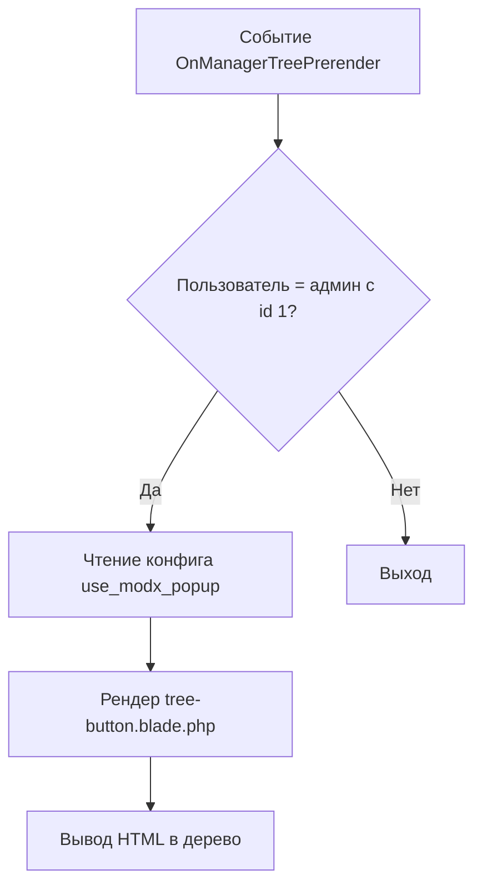

Как работает плагин:

```text
evolution.OnManagerTreePrerender
        ↓
Проверка: userID = 1 (только пользователь с ID 1)
        ↓
Чтение конфига: use_modx_popup (показывать в modx popup или как окно браузера)
        ↓
Рендеринг: tree-button.blade.php
        ↓
Вывод в дерево документов
```

Для нагляжности схема ниже:



Больше плагин ничего не делает. Его единственная задача это добавить иконку консоли в боковое меню админки.