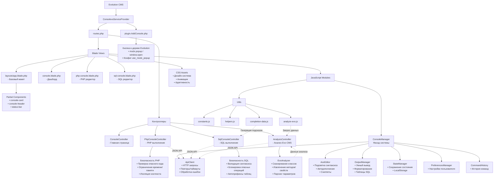

# Общие схемы работы

1. Пользователь → Кнопка в Evolution CE → Загружается Consolevo
2. Blade шаблоны → Рендерят интерфейс → Загружают JS
3. ConsoleManager → Инициализирует модули → Настраивает Ace Editor
4. Пользователь → Вводит код → Нажимает "Выполнить"
5. ConsoleManager → Получает код → Отправляет через ApiClient
6. Контроллер → Выполняет код → Возвращает результат
7. OutputManager → Форматирует результат → Показывает пользователю
8. StateManager → Сохраняет состояние → Для будущих сессий


## Контроллеры

```text
ConsoleController
    └── index() → Главная страница (дашборд)

PhpConsoleController
    ├── index() → Страница PHP консоли
    └── execute() → Выполнение PHP кода

SqlConsoleController
    ├── index() → Страница SQL консоли
    ├── execute() → Выполнение SQL запросов
    └── getTablesForAutocomplete() → Структура БД

AnalysisController
    └── getUnifiedData() → Данные Evo CMS для автодополнения
```

# Всеобщая схема работы

